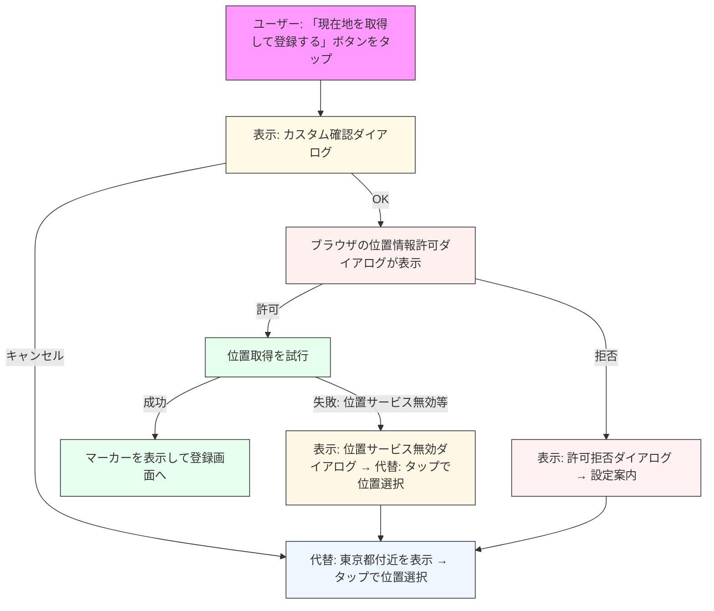

# GeoTrack Mockup

このリポジトリは、ブラウザで動作する位置情報取得のモックアップ（3ページ構成）です。OpenStreetMap + Leaflet を用いて、位置情報の許可拒否時の挙動を確認できます。

位置情報取得の特徴
- ユーザーフレンドリーな許可フロー
  1. 初期設定時: ブラウザのパーミッション確認前に、カスタムダイアログで丁寧に説明
  2. 初回以外: 既に許可済みの場合は直接取得を開始（ユーザー体験を妨げない）

カスタムダイアログの種類と表示条件
1. 初期設定時の確認ダイアログ
   - 表示タイミング: 初期設定ページで「現在地を取得して登録する」ボタンをタップ時
   - メッセージ: 「現在地を自動で表示させる場合には、位置情報が必要です。」
   - 選択肢: 「OK」または「キャンセル」

2. 位置情報が拒否された場合
   - 表示タイミング: ブラウザの位置情報許可が「拒否」された時
   - メッセージ: 端末の設定から位置情報のアクセスを手動で許可する必要がある旨を説明
   - 選択肢: 「閉じる」のみ
   - その後: 地図タップでの位置選択モードに移行

3. 位置情報サービスが無効の場合
   - 表示タイミング: 端末の位置情報サービス自体がオフの時
   - メッセージ: 端末の設定で位置情報サービスを有効にする手順を説明
   - 選択肢: 「閉じる」のみ
   - その後: 地図タップでの位置選択モードに移行

ページ構成
- `index.html` - 初期設定: 位置情報の許可確認と登録（localStorage）
  - カスタム許可確認ダイアログ → ブラウザのパーミッション確認 → 位置情報取得
  - 位置情報を取得できない場合は、地図タップで地点を選択可能
- `page2.html` - 他ユーザー表示: ダミー5ユーザーを表示。登録地点をデフォルト中心に表示し、現在位置取得ボタンあり
- `page3.html` - 登録地点を変更: 登録地点を地図上に表示し、ボタンで現在地に更新

保存方法
- ブラウザの localStorage を使用（キー: `geotrack_location_v1`）。DBは使用していません。

注意点 (HTTPS)
- ブラウザの Geolocation API は、通常 HTTPS（または localhost）でのみ動作します。
- GitHub Pages は HTTPS を提供するため、リポジトリを GitHub Pages に公開すれば問題なく位置情報を取得できます。

使い方（ローカル確認）
1. ファイルをローカルで開く（ただし file:// では geolocation が使えないブラウザがあるため、簡易サーバ推奨）

   macOS（zsh）で簡易サーバを立てる例:

```bash
# リポジトリルートで
python3 -m http.server 8000
# ブラウザで http://localhost:8000 を開きます
```

2. 表示後、`index.html` で「現在地を取得して登録する」を押すと以下のフローが開始されます：
   1. 初期設定時のみ、ユーザーフレンドリーなカスタムダイアログを表示
      - メッセージ: 「現在地を自動で表示させる場合には、位置情報が必要です。」
      - 目的: ブラウザの許可ダイアログが突然表示されることを防ぎ、ユーザーの理解を促進
   2. OKを選択すると、ブラウザの位置情報許可ダイアログが表示
      - この段階でユーザーは位置情報が必要な理由を理解済み
   3. 許可後、現在地が取得され地図上にマーカーが表示
      - 一度許可すると、次回以降は直接位置情報を取得（カスタムダイアログは表示されない）
   4. キャンセルまたは拒否の場合は、代替フローを提供
      - 東京都付近の地図を表示
      - タップで位置を選択可能
      - 必要に応じて適切なガイダンスを表示（設定変更方法など）

公開（GitHub Pages）
1. リモートに push します。
2. GitHub リポジトリの Settings → Pages で公開ブランチを選択します（通常 `main` の `/ (root)`）。
3. 公開された `.github.io` ドメインは HTTPS 対応されるため、Geolocation API が動作します。

モバイルブラウザ（iOS / Android, Safari / Chrome）で位置情報が正常に動作しない主な原因
- HTTPS（安全なコンテキスト）が使われていない（Geolocation API は通常 HTTPS または localhost のみ有効）
- ブラウザのサイト単位の位置情報アクセスが「拒否」または「ブロック」されている
- OS（端末）の位置情報サービスがオフになっている
- ブラウザのプライベート/シークレットモードやコンテンツブロッカー（広告・プライバシー拡張）が許可ダイアログや位置情報取得を妨げている
- WebView / in-app ブラウザでは位置情報が制限される場合がある（アプリ側で許可が必要）
- 位置情報の精度低下や省電力モードにより位置取得に失敗する
- ネットワークが遮断されており、推定位置（IPベース等）や補助手法が使えない
- ブラウザ・OSのバグやバージョン差異（特に古いiOS Safariの仕様差）

トラブルシュートのチェックリスト（ユーザー向け）
1. サイトが HTTPS で提供されているか確認（GitHub Pages 等を利用）
2. ブラウザの設定でサイトの位置情報アクセスが許可されているか確認
3. 端末の設定で位置情報サービスが有効になっているか確認
4. コンテンツブロッカーやプライバシー拡張を無効化して再試行
5. WebView やアプリ内ブラウザを避け、ネイティブブラウザ（Safari / Chrome）で試す

今回の「優しい ASK（カスタム確認ダイアログ）」導入フロー（Mermaid）



（注）Mermaid のレンダリングは GitHub 上の Markdown プレビューまたは Mermaid 対応のビューアで確認してください。

ライセンス: MIT
